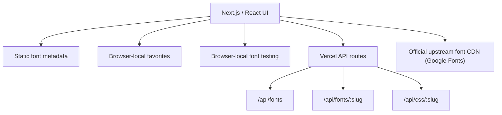

<div align="center">


# FontAtlas

### A clean, no-login font discovery and developer integration platform for the modern web.

**50+ curated fonts. Live preview. Code snippets. Public API. Zero sign-ups.**

[](https://nextjs.org)
[](https://www.typescriptlang.org)
[](./LICENSE)
[](https://vercel.com)

---

</div>

> [!NOTE]
> **FontAtlas** is designed around open-source and licensed fonts with official upstream delivery rather than blindly mirroring font files. No login. No Supabase. No Firebase. No Render. Just fonts.

---

## Table of Contents

- [What is FontAtlas?](#what-is-fontatlas)
- [Key Features](#key-features)
- [Quick Start](#quick-start)
  - [Prerequisites](#prerequisites)
  - [Run Locally](#run-locally)
  - [Production Build](#production-build)
- [Deploy to Vercel](#deploy-to-vercel)
- [Architecture](#architecture)
- [API](#api)
- [Extending the Catalog](#extending-the-catalog)
- [Font Licensing](#font-licensing)
- [Design Reference](#design-reference)
- [License](#license)
- [Developed By](#developed-by)

---

## What is FontAtlas?

FontAtlas is a modern font library built with Next.js 15 and React 19. It gives developers a fast, beautiful way to discover, preview, compare, and integrate fonts into any project — without creating an account.

It uses Google Fonts as its upstream CDN for web font delivery and stores license/source metadata alongside each font record.

<details>
<summary><strong>Why FontAtlas?</strong></summary>

Finding the right font is harder than it should be. Most font tools require sign-ups, have limited previews, or don't give you the code you need. FontAtlas solves all three: instant search, live preview with your own text, and copy-paste code snippets for every major framework.

</details>

<details>
<summary><strong>Not a font redistribution service</strong></summary>

FontAtlas does not mirror or redistribute font files. The catalog links to official upstream sources (Google Fonts) and stores license metadata. Before adding a font to an owned CDN, verify its license and redistribution terms.

</details>

---

## Key Features

- **50+ curated fonts** covering sans, serif, slab, monospace, display, handwriting, script, blackletter, pixel, and multilingual fonts
- **Instant search** across family names, designers, categories, and tags
- **Category and Unicode-script filtering** (Latin, Devanagari, Malayalam, Tamil, and more)
- **Live font preview** with custom text, weight, size, and letter-spacing controls
- **Font comparison** — up to 3 fonts side by side
- **Typography playground** — test heading and body font pairings
- **Browser-local favorites** via localStorage
- **Local font testing** — upload and inspect `.ttf`, `.otf`, `.woff`, `.woff2` files in-browser with OpenType.js
- **Developer code snippets** for CDN, CSS, HTML, Tailwind, Next.js, and React
- **Public metadata API** — no authentication required
- **Per-font CSS endpoint** for easy integration
- **License and source metadata** for every font
- **Responsive UI** — desktop, tablet, and mobile
- **Vercel-ready** — deploy in one click

---

## Quick Start

### Prerequisites

- **Node.js 18+**
- **npm** (or yarn/pnpm)

### Run Locally

```bash
git clone https://github.com/jojin1709/fontatlas.git
cd fontatlas
npm install
npm run dev
```

Open [http://localhost:3000](http://localhost:3000) in your browser.

### Production Build

```bash
npm run build
npm start
```

---

## Deploy to Vercel

1. Push this repository to GitHub.
2. Import the repository into [Vercel](https://vercel.com).
3. Framework preset: **Next.js**.
4. No environment variables are required.
5. Deploy.

[](https://vercel.com/new/clone?repository-url=https://github.com/jojin1709/fontatlas)

---

## Architecture



Stage by stage:

1. **Next.js / React UI** renders the full application with client-side interactivity.
2. **Static font metadata** provides the catalog of 50+ curated fonts.
3. **Browser-local favorites** persist user selections in localStorage.
4. **Browser-local font testing** parses uploaded font files with OpenType.js.
5. **Vercel API routes** serve catalog data and CSS endpoints.
6. **Official upstream font CDN** delivers web fonts from Google Fonts.

---

## API

| Endpoint | Description |
| --- | --- |
| `GET /api/fonts` | Full catalog metadata |
| `GET /api/fonts/inter` | Single font record (replace `inter` with any slug) |
| `GET /api/css/inter` | Reusable CSS endpoint (replace `inter` with any slug) |

### Example

```bash
# Get the full catalog
curl https://your-domain.vercel.app/api/fonts

# Get a single font
curl https://your-domain.vercel.app/api/fonts/inter

# Get CSS for a font
curl https://your-domain.vercel.app/api/css/inter
```

---

## Extending the Catalog

Add a new object to `lib/fonts.ts`:

```typescript
{
  slug: "my-font",
  family: "My Font",
  designer: "Designer Name",
  category: "Sans Serif",
  tags: ["modern", "clean"],
  scripts: ["Latin"],
  weights: [400, 700],
  variable: false,
  styles: ["normal", "italic"],
  license: "SIL Open Font License 1.1",
  licenseUrl: "https://scripts.sil.org/OFL",
  sourceUrl: "https://fonts.google.com/specimen/My+Font",
  googleFamily: "My+Font",
  description: "A description of the font."
}
```

> [!WARNING]
> Do not invent license information. Keep all fields accurate and verified.

---

## Font Licensing

FontAtlas must not mirror or redistribute font files unless the applicable license permits the exact intended use. The catalog uses official upstream web delivery (Google Fonts) and stores license/source metadata.

For a future production CDN layer, Cloudflare R2 + Cloudflare edge delivery can be added for fonts explicitly licensed for redistribution. Keep immutable/versioned URLs and correct CORS/MIME/cache headers.

---

## Design Reference

`public/design-reference.png` contains the approved visual direction used for the initial UI.

---

## License

This project is licensed under the **MIT License**. See the [LICENSE](./LICENSE) file for details.

> [!IMPORTANT]
> The MIT license covers the FontAtlas codebase. Font files themselves are subject to their own licenses as documented in the catalog metadata.

---

## Developed By

**JOJIN JOHN**

[](https://github.com/jojin1709)

---

<div align="center">

**FontAtlas** — A modern font library for a better web.

</div>
